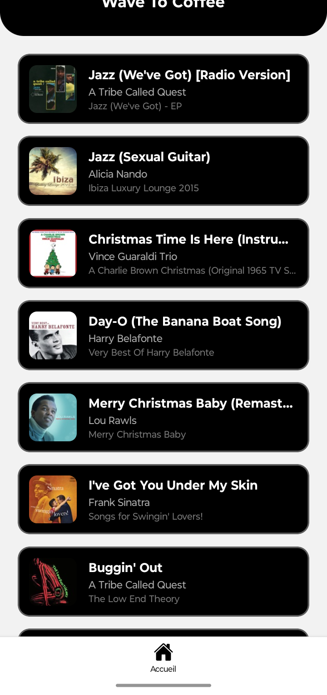

    <h1>WaveToCoffee</h1>
    
Simple React Native hand-crafted Music Player - Coffee Themed as always  Feel free to contribute

# Features

- Listing of all readable audio files from your home folders
- Auto Album (Download, Facebook, Pins etc.)
- All audio are easily editable from the playing screen and listing section ( editable album picture, name, artist )
- (UNSURE) External API that'll suggest similar songs according to your current song

## Installation

Here's a snippet I made at the end of the day.
Those songs are fetched using the iTunes api for now as a quick way to display results.

App still under construction 

